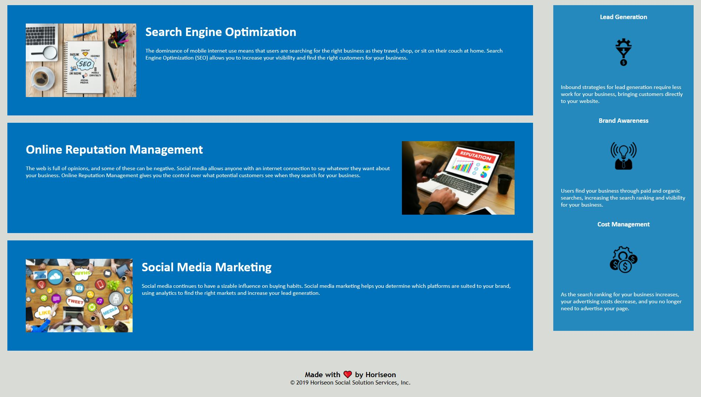

# html-code-refactor
## Intro to html code refactoring, focused on accessibility

I was provided this code template and asked to refactor so that the provided non-semantic HTML elements were updated to more appropriate HTML semantic elements. In addition
there were some layout updates addressed to make the website appear closer to the provided layout. Lastly, CSS elements were consolidated to make a smaller, more dev friendly file.

## Link to Live Project
https://cknig00q.github.io/html-code-refactor/

## Images from Live Site

